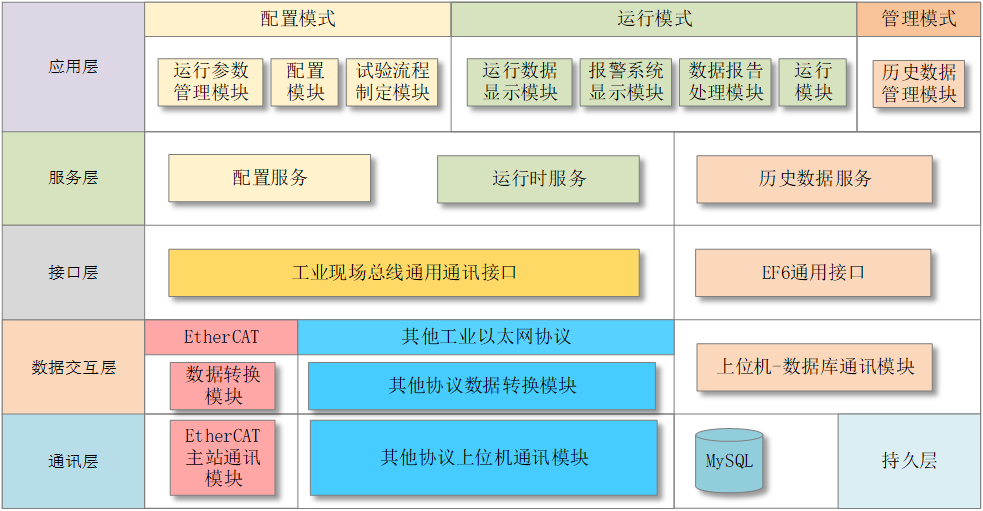

# HyTestBuilder

## 介绍
**HyTestBuilder是一款基于工业以太网的液压测控系统开发平台软件**  
老版本请看 [HyTestBuilder_old](https://github.com/LiuYuxin1002/HyTestBuilder_old)  
测试用例请看[HyTestBuilderTest](https://github.com/LiuYuxin1002/HyTestBuilderTest)  
更新日志请看[修改日志](UPDATE_LOG.md)  
## 软件架构
参见《基于工业以太网的液压试验台测控软件系统研究》论文。

## 安装教程
0. 预处理
	- 安装[winpcap](https://www.winpcap.org)
	- 检查本机是否有 SDK for VS C++(可能会导致无法调试)
1. 添加引用
	- 添加HyTestRTDataService.dll服务引用
	- 添加HyTestEthercatDriver.dll驱动引用
2. 配置  
	1. 在主窗体添加HTConfigManager控件。
    2. 右键选择“HT配置界面”。
	3. 完善信息并点击保存配置（注意：配置文件将存放在解决方案路径/debug目录）。
2. 试运行
	1. 检查配置文件是否加载，如果没有找到配置文件，搜索配置文件config.xml移动到解决方案路径的debug目录下
	2. 检查能否找到驱动(HyTestEthercatDriver.dll)引用，如果没有找到，请检查是否安装[winpcap](https://www.winpcap.org)
	3. 如果运行时出现某某问题导致“堆栈不对称”，尝试将项目的启动方式设置为x86，具体操作为：
		项目右键->生成->目标平台下拉框->x86；
		另外还可以添加CallingConvention = CallingConvention.Cdecl；
		如果没有解决，先检查你的数据类型。
3. 调试
	调试界面可参考[HyTestBuilderTest](https://github.com/LiuYuxin1002/HyTestBuilderTest)解决方案，如果没有，联系我。

4. 反馈
	如果有好的建议或意见，可以在github创建账号，拉你到HyTestBuider项目：[HyTestBuilder](https://github.com/LiuYuxin1002/HyTestBuilder)

---

## 使用说明

1. 开发环境Visual Studio 2015，根据开发环境不同可能会无法编译；
2. 有时存在找不到ExportDll（现在是HyTestEtherCATDriver.dll）的情况；

## 异常解决
1. Q: HyTestEtherCAT.CppConnect::setDigitalValue”的调用导致堆栈不对称。原因可能是托管的 PInvoke 签名与非托管的目标签名不匹配。请检查 PInvoke 签名的调用约定和参数与非托管的目标签名是否匹配。 
   A: 添加CallingConvention = CallingConvention.Cdecl

### 2020.2.21
#### 添加倍福位移传感器EL5151
##### 传感器参数：   
  SM2 outputs   
     addr b   index: sub bitl data_type    name  
  [0x0000.0] 0x7000:0x01 0x01 BOOLEAN      Enable latch C  
  [0x0000.1] 0x7000:0x02 0x01 BOOLEAN      Enable latch extern on positive edge  
  [0x0000.2] 0x7000:0x03 0x01 BOOLEAN      Set counter  
  [0x0000.3] 0x7000:0x04 0x01 BOOLEAN      Enable latch extern on negative edge  
  [0x0000.4] 0x0000:0x00 0x04  
  [0x0001.0] 0x0000:0x00 0x08  
  [0x0002.0] 0x7000:0x11 0x20 UNSIGNED32   Set counter value  
  SM3 inputs  
     addr b   index: sub bitl data_type    name  
  [0x0006.0] 0x6000:0x01 0x01 BOOLEAN      Latch C valid  
  [0x0006.1] 0x6000:0x02 0x01 BOOLEAN      Latch extern valid  
  [0x0006.2] 0x6000:0x03 0x01 BOOLEAN      Set counter done  
  [0x0006.3] 0x0000:0x00 0x04  
  [0x0006.7] 0x6000:0x08 0x01 BOOLEAN      Extrapolation stall  
  [0x0007.0] 0x6000:0x09 0x01 BOOLEAN      Status of input A  
  [0x0007.1] 0x6000:0x0A 0x01 BOOLEAN      Status of input B  
  [0x0007.2] 0x6000:0x0B 0x01 BOOLEAN      Status of input C  
  [0x0007.3] 0x0000:0x00 0x01  
  [0x0007.4] 0x6000:0x0D 0x01 BOOLEAN      Status of extern latch  
  [0x0007.5] 0x6000:0x0E 0x01 BOOLEAN      Sync error  
  [0x0007.6] 0x0000:0x00 0x01  
  [0x0007.7] 0x6000:0x10 0x01 BOOLEAN      TxPDO Toggle  
  [0x0008.0] 0x6000:0x11 0x20 UNSIGNED32   Counter value  
  [0x000C.0] 0x6000:0x12 0x20 UNSIGNED32   Latch value  
  [0x0010.0] 0x6000:0x14 0x20 UNSIGNED32   Period value  
   
1. 定义(mycontext.h)：添加位移传感器结构体和链表
2. 接口(mycontext.cpp)：中添加读写接口
3. 初始化(SlaveConfigSystem.cpp)：
   1. 修改方法initLocalSlaveInfo()，在条件判断中加入如何判断是位移传感器，我的条件是输入输出都不为0且型号包含“EL5”关键字；
   2. 仿照伺服驱动器的方法，initLocalSlaveInfo()方法的本质目的是初始化数组slave_arr[]，并将数组中的输入输出映射到ec_slave的输入输出
4. 读取计数器(SlaveReadManager.h/.cpp):

5. 写入接口实现(SlaveWriteManager.h/.cpp):